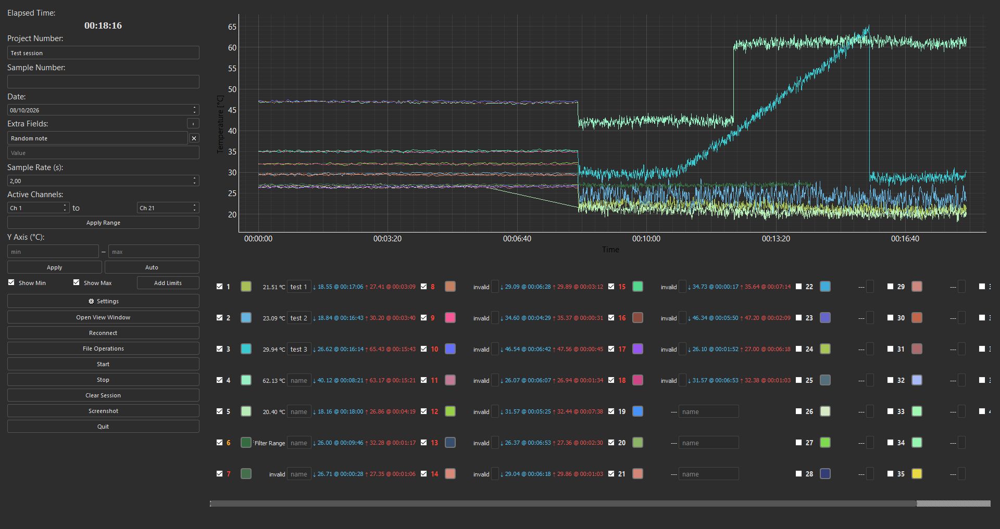
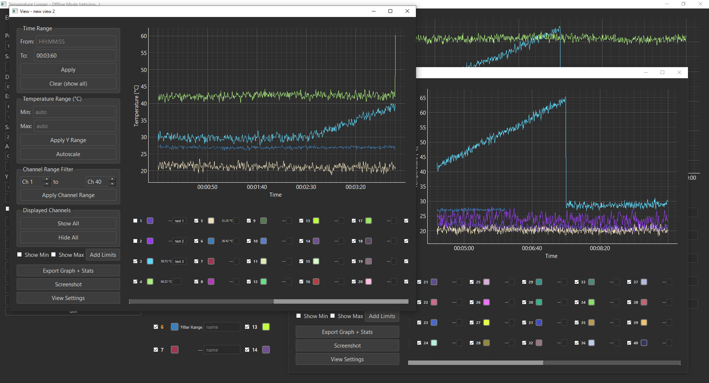

# Temperature Logger

A single-file desktop data-acquisition tool for the **Keysight DAQ970A**, 
and for other Keysight/Agilent DAQ instruments that use the same 
slot/position SCPI channel addressing and `MEAS:TEMP:TC?` command form.

Reads thermocouple channels over LAN or USB, plots them live, logs them
to a crash-safe append-only session file, and exports to CSV / PNG.



## Functionality

- **Live plotting** of thermocouple channels (40 by default,
  configurable), with per-channel colors, names, and min/max limit
  lines.
- **Crash-safe session logs** — every sample is written as a hashed
  line the moment it arrives, so an interrupted session is still
  readable and truncation is detectable. Raw instrument responses are
  preserved unprocessed; filtering and exports are derived views.
- **Incremental filtering** — a rate-of-change / min-run filter that
  judges each new sample against a channel's recent state, so refresh
  cost stays constant no matter how long the session runs.
- **Held-value warning** — a channel whose readings keep failing the
  filter shows a warning instead of a stale number.
- **CSV / PNG export**, **config export / import**, and an **offline
  mode** that retries in the background until an instrument appears.

### Secondary view windows

View windows are independent second plots, backed by the same live
session as the main graph but with their own time range, Y-axis range,
and visible-channel set. A view keeps updating as new samples arrive,
so it can be used to watch a specific part of the run while the main
window shows the whole session — or to run several views side by side,
each following a different subset of channels.

The typical use is when the same instrument is wired to more than one
test at once: the main window is the overview, one view follows the
channels belonging to test A, another follows test B, and each is
zoomed to whatever time window matters for it. Views don't interfere
with each other or with the main graph, and closing one doesn't affect
the underlying session.

Views are saved by name and can be reopened later, with their time
range, channel selection, and layout restored. Each view has its own
font size and column layout, set independently of the main window via
View Settings.



## Requirements

- Python 3.8 or newer
- A Keysight DAQ970A, or another Keysight/Agilent DAQ instrument using
  the same `MEAS:TEMP:TC?` SCPI command and slot/position channel
  addressing
- NI-VISA (recommended) or the pure-Python `pyvisa-py` backend

The script installs its own Python dependencies on first run
(`numpy`, `pyqtgraph`, `pyvisa`, `PyQt5`, `pyvisa-py`) and restarts
itself.

## Background

Originally developed as a tool in a safety and standards testing lab,
running under non-privileged user accounts with corporate endpoint
security active — no admin rights, no ability to install software
system-wide, and direct device communication frequently flagged and
blocked.

These constraints shaped the tool's deployment path: NI-VISA proved to
be the reliable way to establish an unflagged, stable connection to
the instruments, and the Microsoft Store build of Python was the 
most convenient way to get an interpreter onto the machine without admin rights.
The script installing its own dependencies into the user's site-packages
on first run — rather than requiring a normal `pip install` — is a
response to that same environment.

The single-file design is deliberate: it can be quickly copied and set up
onto a lab machine by hand, run without any project structure, and either
installs its dependencies or fails loudly with a clear error.

## Quick start

Download `TempLogger.py` from the repo, or clone it:

```sh
git clone https://github.com/Robi7d1/keysight-daq-templogger.git
cd keysight-daq-templogger
```

Run it:

```sh
python TempLogger.py
```

The script creates its subdirectories and config files in its own
directory.

On launch you'll get a connection dialog: scan the network,
connect by IP, connect via USB, or run in offline mode.

## Demo data

To try the tool without a DAQ970A attached, either import the included
example session or generate a fresh one.

### Pre-generated example

[`docs/examples/demo_session.log`](docs/examples/demo_session.log) is a
small committed session with six channels, one ramp, one step change,
and a channel that drops out partway through. Import it via
**File Operations → Import Session**.

### Generator

[`create_demo_session.py`](create_demo_session.py) opens a small dialog
for producing custom synthetic sessions — channels, duration, sample
interval, starting temperature, noise level, and optional fault
injection (periodic spikes, a stuck channel, a channel that drops out,
corrupted hash lines, impossible event sequences).

```sh
python create_demo_session.py
```

The output is written in the same format the app's own `SessionWriter`
produces, so importing it exercises the same read path as a real
capture.

## Session files

Sessions are written to `sessions/` as append-only text logs. Each line
is self-describing and carries its own SHA-256 hash, so:

- An interrupted session is still readable up to the last complete line.
- A truncated file is detectable (the last line fails its hash check).
- A single line can be verified without reading the rest of the file.

`File Operations → Import Session` reads these back into the app,
including any event markers (PAUSED / RESUMED / SESSION_IMPORTED).
`File Operations → Save Data` exports the current session to CSV and a
raw `numpy` array.

## Configuration

Settings and saved state live in four places, all under the script
directory:

| Path | Contents |
|---|---|
| `.keysight_config.json` | UI settings, channel limits, channel addresses |
| `.keysight_session.json` | Lab metadata (serial/customer numbers, channel names, extra fields) |
| `window_settings/*.json` | Per-view-window settings |
| `sessions/*.log` | Session logs |

None of these are intended to be committed to version control — see
`.gitignore`.

`File Operations → Export Configuration` bundles the config into a
single portable JSON file that can be re-imported on another machine.

## Channel addressing

By default, channel *n* (1-indexed) maps to SCPI address
`(n-1)//20+1` `*100` `+ (n-1)%20+1` — i.e. 20 channels per cassette,
starting at cassette 1. This matches a DAQ970A with one 20-channel
multiplexer in slot 1.

If your instrument is wired differently, `Settings → Performance →
Channel Hardware` lets you set the cassette size and offset, or open
`Edit Channel Addresses…` to override any individual channel's address.
The address table is locked while a session is in progress, to keep it
from changing under a running measurement thread.

## License

GPL v3 — see [LICENSE](LICENSE).
